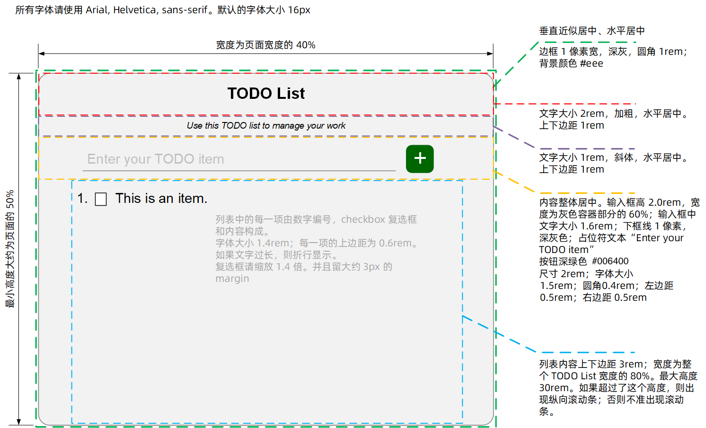
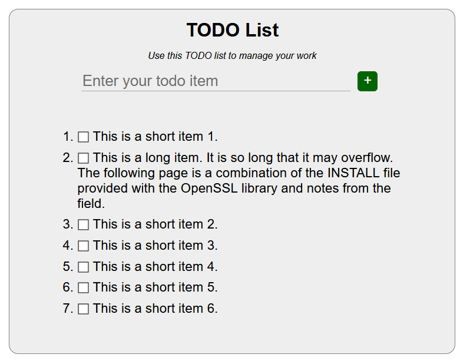
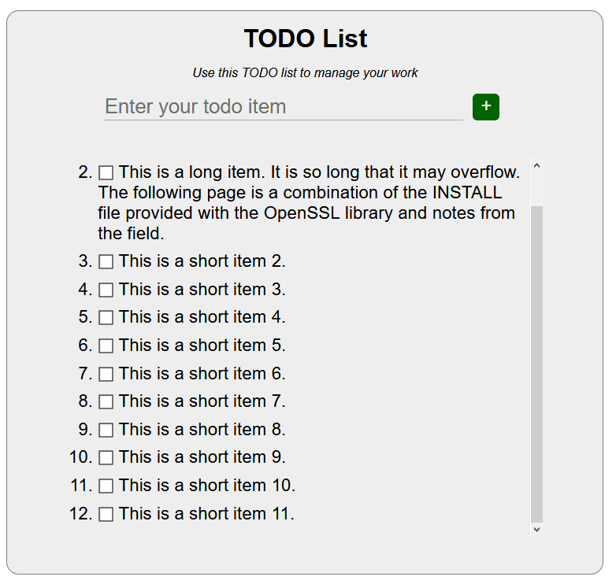
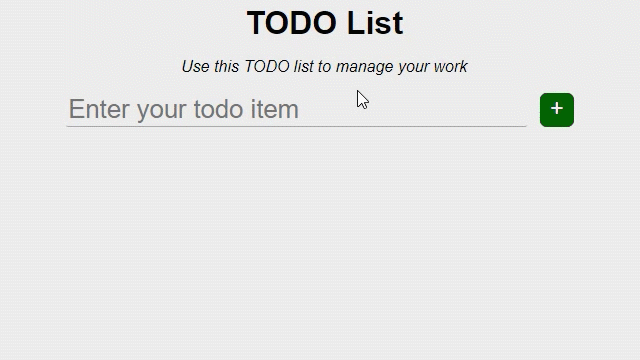
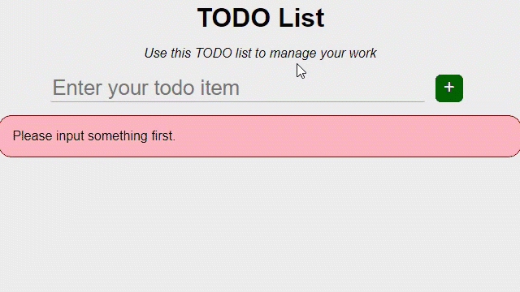
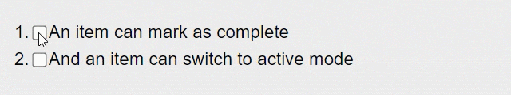
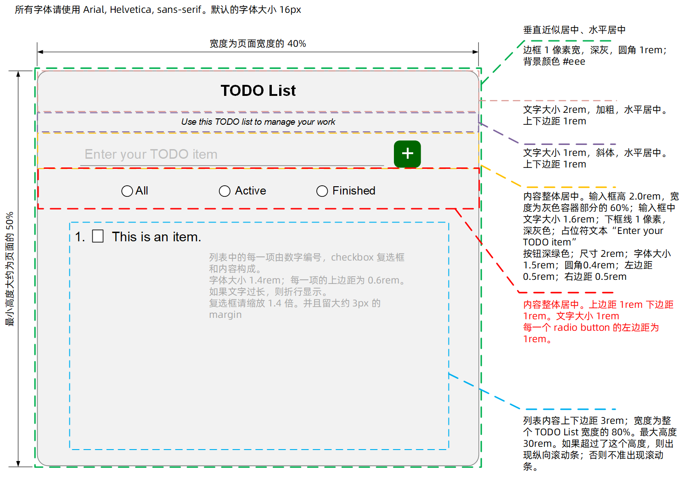
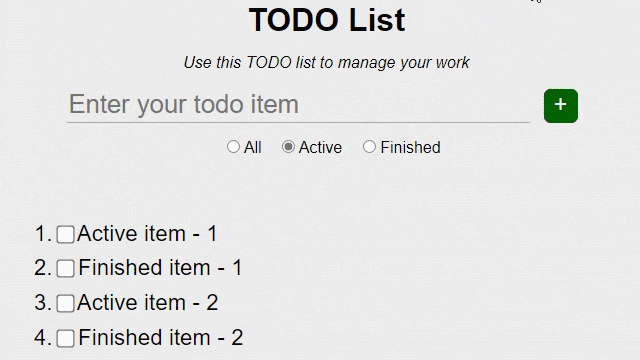
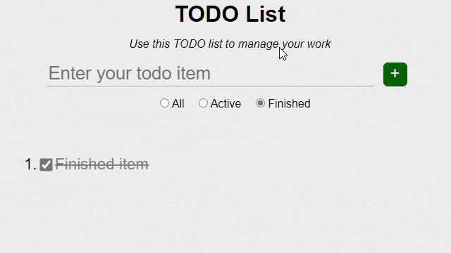

# TODO List Homework

请迭代完成以下需求：

## Story 1：创建基本的页面结构

第一个 Story 不会涉及任何动态的效果。我们需要展现出最终的页面样式来。而后一步一步的添加功能。因为客户需要看一看最终的效果才能确定是否继续这个项目。

最终页面设计如下：



实际展示效果如下：



若 TODO Items 较多，则会出现纵向滚动条。



## 从 Story 2 开始你可能需要如下参考资料

1. [DOM概述](https://developer.mozilla.org/zh-CN/docs/Web/API/Document_Object_Model/Introduction)
1. [使用 W3C DOM Level 1 核心](https://developer.mozilla.org/zh-CN/docs/Web/API/Document_Object_Model/Using_the_W3C_DOM_Level_1_Core)
1. [使用Javascript和DOM Interfaces来处理HTML](https://developer.mozilla.org/zh-CN/docs/%E4%BD%BF%E7%94%A8Javascript%E5%92%8CDOM_Interfaces%E6%9D%A5%E5%A4%84%E7%90%86HTML)
1. [使用选择器定位DOM元素](https://developer.mozilla.org/zh-CN/docs/Web/API/Document_Object_Model/Locating_DOM_elements_using_selectors)
1. [事件及DOM](https://developer.mozilla.org/zh-CN/docs/Web/API/Document_Object_Model/Events)

## Story 2 添加 Item

作为一个用户，我应当能够添加 Item。这样我就可以创建待办事项列表了。

### AC 0 初始状态

* 默认显示的列表应当是空的。没有任何 TODO item。

### AC 1 添加 Item

* 我应当能够在输入框（就是 Enter you TODO item 那个输入框）中输入 TODO item 的内容（内容为纯文本）。
* 当我输入完毕之后，点击绿色的 “+” 按钮就可以在 TODO item 列表中添加一个新的 item，且它的文本应该和我输入的文本一致。
* 当新的 item 添加完毕之后，应当清空输入框中的文字。



### AC 2 避免开头和结尾的空格

* 当我输入的文本含有开头和结尾的空白字符的时候，在添加过程中应当去掉这些空白字符。例如我输入 “  Good  ”，则最终添加的内容应当是 “Good”。空白字符以 `String.prototype.trim` 的默认情况为准。

### AC 3 错误检查

* 当我输入的文本为空文本时，或我输入的文本全部为空白字符的时候。应当显示一个错误消息：“Please input something first.” 


* 如果输入了错误的文本，则输入完毕之后必要清空输入框中的内容。
* 错误消息的应当在 Enter your TODO item 下方。上边距 1rem，内边距 1rem。宽度应当为灰色外层容器宽度的 80%。边框 1px，圆角 1rem，边框颜色深红色（darkred，#8B0000），背景颜色浅粉色（lightpink，#FFB6C1），字体颜色黑色（black，#000000），字体大小 1rem。
* 但是当我成功的添加了一个 Item 之后，错误信息应当消失。



## Story 3 标记完成状态

作为一个用户，我希望更明显的显示一个 TODO item 是否已经完成。这样我更容易看清整体的任务情况。

### AC 1 完成状态的显示与切换

* 当一个 TODO item 标记为完成状态（checkbox 处于选中状态）的时候，TODO item 的文本应该变为灰色（gray，#808080）。并且文本应该显示删除线。
* 当一个 TODO item 重新处于激活状态（checkbox 未选中）的时候，TODO item 的文本应当恢复为黑色（black，#000000），并不显示删除线。



## Story 4 显示过滤视图

作为用户我希望能够过滤特定的 TODO items。这样我能够更好的聚焦在一类任务上。

### AC 1 添加视图过滤按钮

* 请在输入框下添加 3 个视图过滤按钮。分别为 All、Active 和 Finished
* 其布局如下图所示
* 默认情况下 All 应当处于选中状态



### AC 2 切换视图显示

* 当选中 *All* 视图的时候，视图中应当显示 Active 状态 和 Finished 状态的 Items。并且 Items 应当按照添加的顺序排序。
* 当选中 *Active* 视图的时候，视图中应当只显示 Active 状态的 的 Items。并且 Items 应当按照添加的顺序排序。
* 当选中 *Finished* 视图的时候，视图中应当只显示 Finished 状态的 的 Items。并且 Items 应当按照添加的顺序排序。


### AC 3 切换视图显示时的操作行为

* 当选中 *Active* 视图的时候，由于视图只能够显示 Active 的 Item。因此如果在该视图将 item 标记为 Finished，则这个 item 应当立即消失。



* 当选中 *Finished* 视图的时候，由于视图只能够显示 Finished 的 Item。因此如果在该视图添加新的 item。则添加的 item 不会显示出来。但是添加操作本身还是成功的。



# 提示

此问题需要修改的代码位于 *public* 目录下。其中 JS 脚本文件请放在 *public/script* 目录下，而 CSS 文件请放在 *public/styles* 目录下。

*public/styles* 目录下提供了 *css-reset.css* 文件，请根据需要确定是否采用。

## 运行单元测试

请执行如下代码运行单元测试；请注意：如果你在 IDE 中运行单元测试，会由于找不到依赖而失败，请使用如下代码在终端运行测试

For Windows:

```
$ npm start
$ npm run test
```

For macOS & Linux: 

```
$ npm run e2e
```

## 运行网站

请执行如下代码运行网站并打开页面：

```bash
$ npm start
```

之后在浏览器中访问：http://localhost:4444

## Lint 检查

如需对代码执行 Lint 检查，请执行如下命令：

```bash
$ npm run lint
```

# 代码的评价分为如下几个层面

* 是否通过了相应的测试
* 是否满足了需求中的逻辑
  * 不限于现有的测试涵盖的逻辑
* 是否使用了正确的编码实践
  * 代码的格式是否正确（无任何 linting 错误）
  * 代码的命名是否有意义
  * 代码是否遵循了小步提交原则
  * 代码的提交信息是否明确有意义。是否使用了语义化提交
* 代码质量
  * 使用合适的类库合适的方法解决问题
